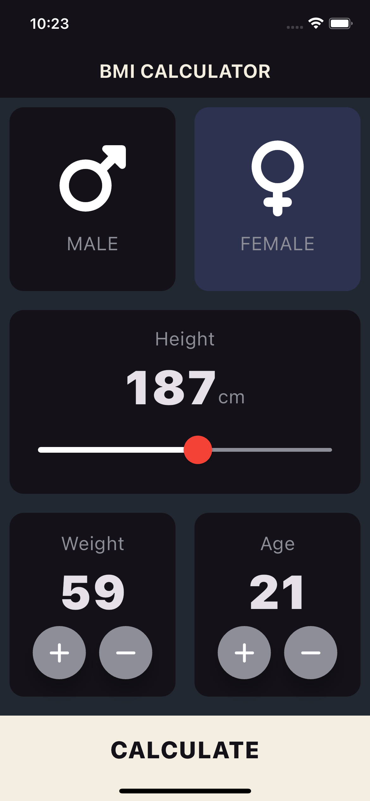
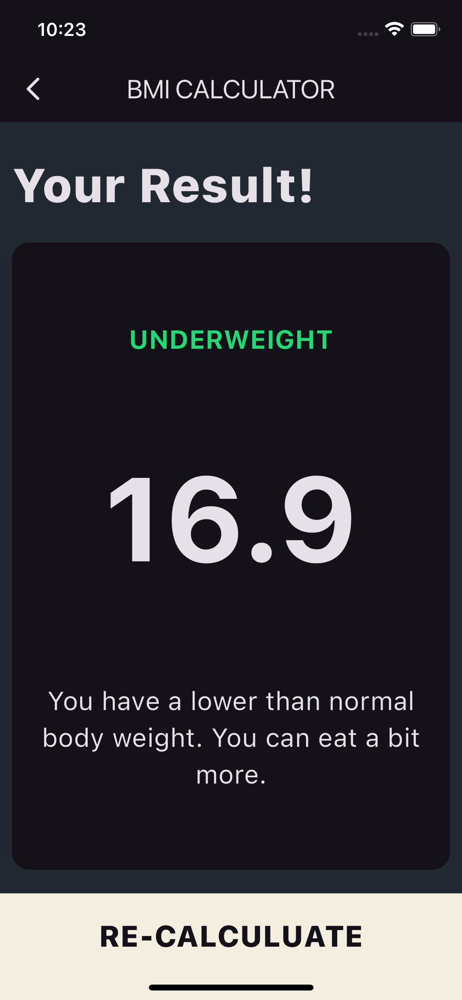

# BMI Calculator

## Overview

The BMI Calculator is a Flutter application designed to calculate and display Body Mass Index (BMI) based on user input. The app provides users with a simple and intuitive interface to input their height, weight, and age, and receive information about their BMI status along with health interpretations.

## Features

- **Input Page**: Allows users to select their gender, enter their height, weight, and age.
- **BMI Calculation**: Computes BMI using the formula `weight / (height/100)^2`.
- **Result Page**: Displays the calculated BMI, BMI category (Overweight, Normal, Underweight), and health interpretation.
- **Recalculate Option**: Users can navigate back to the input page to make new calculations.

## Screenshots

<p float="left">
  
  
</p>

## Getting Started

To run this project locally, follow these steps:

1. **Clone the Repository**

   ```bash
   git clone https://github.com/risal-ea/bmi_calculator-.git
